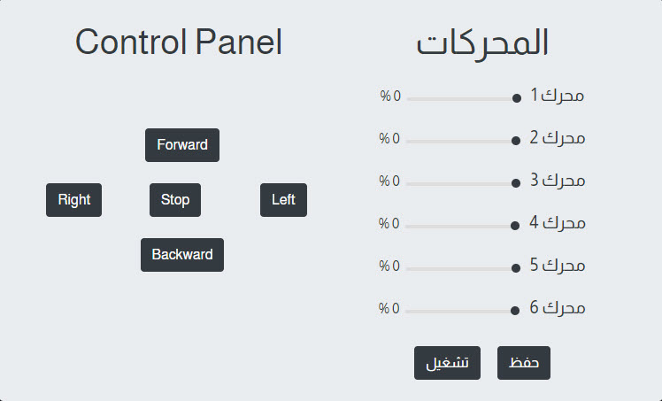
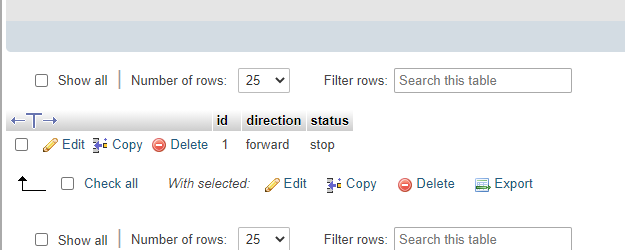

# Control-Panel

## المقدمة:

##### في المهمة الثانيه من مهمات الاساليب الذكية الطلب كان كنترول بانل مع خمسه ازرار ودمج لوحة التحكم الذراع مع لوحة التحكم بالقاعدة في واجهة واحدة
##### تجربه جميله وقدرنا ان شاء الله ننفذها بشكل جميل كانت خفيفه ولطيفه.  

## المهام المطلوبة:

<ul>
  <li>دمج لوحة التحكم الذراع مع لوحة التحكم بالقاعدة في واجهةواحدة.</li>
  <li>تحويل الواجهة او عرضها كموبايل ويب فيو.</li>
  

</ul>

## طريقة إنشاء الكنترول بانل:

##### طريقة الانشاء كانت خفيفه ودمجناها مع صفحتنا في المهمة الاولى واستخدمنا نفس الطريقه. عندنا في الصفحه  ستة من المحركات والكنترول بانل فيها 5 ازرار لكل زر وظيفه معينة والمكتبه الي استخدمناها ساعدت في عرضها كموبايل ويب فيو الي هي البوتسراب. 
 

##### اما الجزئيه الاخرى الي هي الباك-اند استخدمنا فيها [PHP, MYSQL]. استخدمناهم في انشاء وربط الداتا بيس وهناك خمسة خيارات في الكنترول بانل تسجل في الداتا بيس كما هو موضح في المثال تحت سيتم تمكين الازرار بمجرد الضغط عليها لو ضغطنا يسار راح ينحفظ يسار وهكذا.

## الواجهة & الداتا بيس:

#### صورة توضيحية للواجهة.

#### صورة توضيحية للداتا بيس حقت الكنترول بانل.

  
  
  

  

